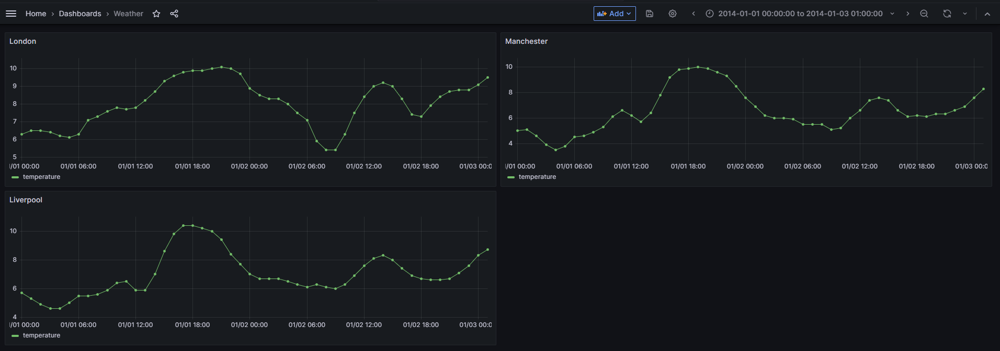

# SCC413 Data Pipeline Coursework

- [SCC413 Data Pipeline Coursework](#scc413-data-pipeline-coursework)
  - [Start Pipeline](#start-pipeline)
  - [Airflow](#airflow)
  - [Grafana](#grafana)
  - [Interface Detail](#interface-detail)
  - [Table](#table)

<a href="https://github.com/psf/black"></a>

**My development environment is WSL 2, in theory docker can run in any environment. If you encounter any problems while using, please contact me, I will fix any possible issues as soon as possible.**

Thanks for reading.😀😀😀

## Start Pipeline

Please run the following command in the project root directory to start pipeline

```bash
bash docker-compose-restart.sh
```

This command will take tens of seconds to run on my computer to complete. It will start multiple containers, and when the following message appears on the screen, saying that the airflow web server is listening on port 8080, it means that the data pipeline has been started successfully.


When you want to exit the data pipeline, just type **Ctrl + C**.

## Airflow

Once the data pipeline has been successfully started, please use your browser to open the following URL http://127.0.0.1:8080


Username:admin

Password:admin

After successful login, you will see the 2 data pipelines that have been created


By default, the 2 data pipelines are off. Please turn on the middle switch in the red circle in the figure below.


After the DAG is started successfully, please wait patiently for a while, each DAG will run every 10 seconds, the following figure shows that fact_taskflow has been run successfully 3 times and weather_taskflow has been run successfully 2 times.


## Grafana

The Grafana image we provide is already configured with the data source and dashboard, please use your browser to open the following link: http://127.0.0.1:3000

Username: admin

Password: admin

In Grafana, a dashboard called weather is already pre-installed.


When you click in, you can see the specific contents of the dashboard



## Interface Detail

**Random Useless Fact**

https://uselessfacts.jsph.pl/

```bash
curl https://uselessfacts.jsph.pl/api/v2/facts/random
```

```JSON
{
    "id": "ec5921df7f0fcbb780b4ca37ed77944b",
    "text": "The verb \"cleave\" is the only English word with two synonyms which are antonyms of each other: adhere and separate.",
    "source": "djtech.net",
    "source_url": "http://www.djtech.net/humor/useless_facts.htm",
    "language": "en",
    "permalink": "https://uselessfacts.jsph.pl/api/v2/facts/ec5921df7f0fcbb780b4ca37ed77944b"
}
```

**Random Cat Fact**

https://github.com/wh-iterabb-it/meowfacts

```bash
curl http://127.0.0.1:5000
```

```json
{
    "data": [
        "Your cat recognizes your voice but just acts too cool to care (probably because they are)."
    ]
}
```

**Random Black History Fact**

https://www.blackhistoryapi.io/docs

```bash
curl -X 'GET' \
  'https://rest.blackhistoryapi.io/fact/random?length=4096' \
  -H 'x-api-key: aG9uZ3podmYxVGh1IEFwciAyMCAyMD'
```

```json
{
    "TotalResults": 126,
    "Results": [
        {
            "_id": "1bS7LIUBpqkA2GH5bYdn",
            "id": 1671492621735,
            "createdDateTime": "2022-12-19T23:30:21.694Z",
            "date": "2022-12-19T23:30:21.000Z",
            "length": 41,
            "people": [
                "Bessie Coleman"
            ],
            "source": "https://en.wikipedia.org/wiki/Bessie_Coleman#Honors",
            "status": "approved",
            "tags": [
                "Birthday"
            ],
            "text": "Bessie Coleman was born in Atlanta, Texas"
        }
    ]
}
```

## Table

We have created two tables for weather data pipeline.

**city**

| Column    | Type |
| -------- | ------- |
| city_id  | smallint (primary key)    |
| city_name | varchar(32)     |
| latitude    | real    |
| longitude | real |
| timestamp_track | timestamp |

**temperature**

| Column    | Type |
| -------- | ------- |
| temperature_log_id  | serial (primary key)   |
| city_id | smallint (foreign key) |
| log_time | timestamp |
| temperature | real |

**Elasticsearch**

In the original design, the final step of the fact data pipeline would store data in Elasticsearch and then build a search engine based on that. For example, if a user enters the keyword cat, then the program will return facts related to cat. However, during the actual development process, we found that Elasticsearch and its visualizer Kibana could not run well on the virtual machine provided by the university due to hardware limitations (mainly lack of memory). So the relevant part was removed inside the final report. If you look at the code, you can see that the code related to Elasticsearch has been commented out. Here, we illustrate how the code runs on another high-performance virtual machine.

Assuming that the data from the fact data pipeline has now been imported into Elasticsearch, open it with a browser http://127.0.0.1:5601

First create an index pattern:


Then search in the discover interface, here is the fact_info field for example, suppose we want to search for facts about 🐱, enter the following content, it will return relevant information.


There are more advanced ways to use search, but since this assignment is to build a data pipeline, we won't do more than that here.